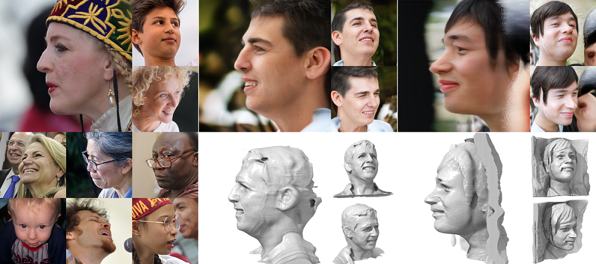

# LPFF-dataset
**LPFF is a large-pose Flickr face dataset comprised of 19,590 high-quality real large-pose portrait images.**




> **[ArXiv] [LPFF: A Portrait Dataset for Face Generators Across Large Poses]()**
>
> [Yiqian Wu](https://onethousandwu.com/), Jing Zhang, [Hongbo Fu](http://sweb.cityu.edu.hk/hongbofu/publications.html), [Xiaogang Jin*](http://www.cad.zju.edu.cn/home/jin)

[[Paper\]](https://arxiv.org/abs/2303.14407) [[Video\]](coming soon) [[Suppl\]](https://drive.google.com/file/d/1Xktg7oqMMNN9hqGYva3BBTJoux17y2SR/view?usp=sharing) [[Project Page\]](coming soon)


The creation of 2D realistic facial images and 3D face shapes using generative networks has been a hot topic in recent years. Existing face generators exhibit exceptional performance on faces in small to medium poses (with respect to frontal faces), but struggle to produce realistic results for large poses. The distorted rendering results on large poses in 3D-aware generators further show that the generated 3D face shapes are far from the distribution of 3D faces in reality. We find that the above issues are caused by the training dataset's posture imbalance. 

In this paper, we present **LPFF**, a large-pose Flickr face dataset comprised of 19,590 high-quality real large-pose portrait images. We utilize our dataset to train a 2D face generator that can process large-pose face images, as well as a 3D-aware generator that can generate realistic human face geometry. To better validate our pose-conditional 3D-aware generators, we develop a new FID measure to evaluate the 3D-level performance. Through this novel FID measure and other experiments, we show that LPFF can help 2D face generators extend their latent space and better manipulate the large-pose data, and help 3D-aware face generators achieve better view consistency and more realistic 3D reconstruction results.


<center>Faces generated by EG3D models trained with FFHQ (Left) and Faces generated by EG3D models trained with our new dataset LPFF and FFHQ (Right).</center>

### News  ✨ ✨ 

- [2023-03-28] The paper pdf is available: [[2303.14407\] LPFF: A Portrait Dataset for Face Generators Across Large Poses (arxiv.org)](https://arxiv.org/abs/2303.14407)
- [2023-03-28] The supplementary pdf is available: [Google Drive](https://drive.google.com/file/d/1Xktg7oqMMNN9hqGYva3BBTJoux17y2SR/view?usp=sharing)


### Usage

**Our [pretrained models](https://github.com/oneThousand1000/LPFF-dataset/tree/master/networks) are available!**

### Available sources

|                                                              | Description                                                  |
| ------------------------------------------------------------ | ------------------------------------------------------------ |
| [networks](https://github.com/oneThousand1000/LPFF-dataset/tree/master/networks) | Pretrained StyleGAN2-ada and EG3D models trained on the LPFF+FFHQ  dataset. |

### TODO

|                     | Description                                                  |
| ------------------- | ------------------------------------------------------------ |
| [dataset]()         | Dataset download. (We released 1,000 example images [here](https://github.com/lpffdataset/LPFF-Dataset).) |
| [data_processing]() | Data processing codes and data download links. Including image alignment, camera parameters extraction, and dataset rebalance. |

### Citation

If you find this project helpful to your research, please consider citing:

```
Coming soon.
```

